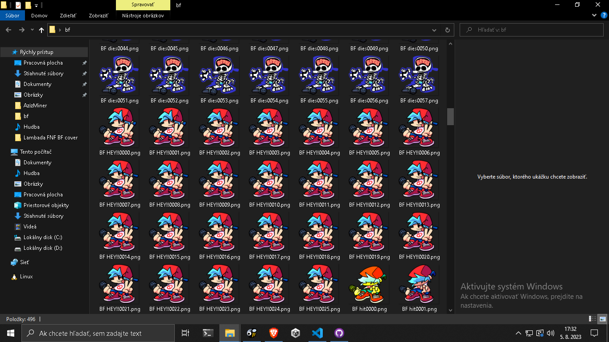

# sparrow2img
---
**sparrow2img** is a python script for unpacking sparrow v2 texture atlas

## Usage
To unpack a texture atlas run:
```shell
python3 sparrow2img.py image.png atlas.xml
```

for example:
```shell
python3 sparrow2img.py BOYFRIEND.png BOYFRIEND.xml
```
This unpacks the [BOYFRIEND.png](https://github.com/FunkinCrew/Funkin/blob/master/assets/shared/images/characters/BOYFRIEND.png) (my beloved ❤) texture atlas and turns it into seperate images:


### Useful flags
- ```-o``` - output directory
